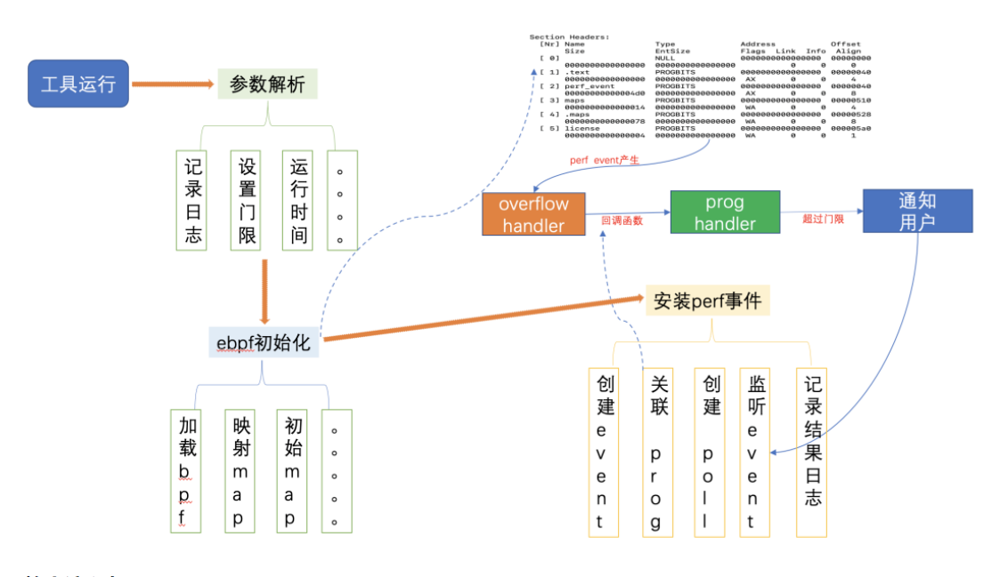
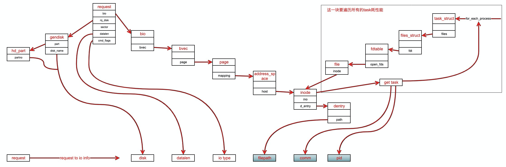

# 第三章：eBPF的应用场景与实践

概述目前主要的应用场景：可观测性（包括问题调查定位）、网络、安

## 3.1 基于eBPF的系统诊断


### 3.1.1 基于eBPF的系统诊断-网络

**问题描述**

网络抖动是指在网络传输过程中，因为各种原因导致数据包的传输延迟增加的现象。网络抖动可能会导致网络连接不稳定，影响网络应用程序的性能和用户体验。一般情况下，网络抖动问题会对客户的业务产生很大的影响。下面是一些比较典型的案例：

1. 网络连接不稳定：网络抖动会导致网络连接的不稳定性，使得客户在使用网络应用程序时经常出现连接断开、页面加载缓慢等问题。
2. 影响在线业务：对于在线业务来说，如在线游戏、视频会议、在线购物等，网络抖动会导致数据传输的延迟增加，使得用户无法流畅地进行交互或观看，影响用户体验，甚至导致交易失败。
3. 影响远程办公：在远程办公的情况下，网络抖动会导致视频会议、文件传输等协作工具的不稳定性，影响远程团队的工作效率和沟通效果。
4. 影响云服务：对于使用云服务的客户来说，网络抖动会导致云服务的不稳定性，使得客户无法正常访问或使用云服务提供的功能。
5. 业务中断：在某些情况下，网络抖动可能会导致网络连接断开，使得客户无法访问网络或者无法与服务器建立稳定连接，导致业务中断，造成损失。

**传统解决方案**

传统的定位网络抖动问题主要通过一下几类工具。

1. 网络数据包分析工具：如Wireshark、tcpdump等，这些工具可以捕获和分析网络数据包，通过分析数据包的延迟、丢包情况，定位网络抖动问题所在。
2. 网络故障排查工具：如Ping、Traceroute等，这些工具可以用于排查网络故障，如检测网络连接的连通性、确定网络路径和跳点等，帮助确定网络抖动问题的发生位置。
3. 网络设备监控工具：如SNMP（Simple Network Management Protocol）管理工具，可以实时监控网络设备的状态和性能，包括路由器、交换机等，有助于发现设备故障引起的网络抖动问题。

网络链路是非常复杂且漫长的，一个报文从发送端到达接收端，要穿越各种网络组件，比如容器、ECS、OS内核、物理机、VPC网络、物理网络等。上面那些工具很难达到细粒度的网络抖动问题。

**eBPF解决方案**

网络抖动问题定位周期长，定位难度大（跨很多组件），业务影响严重的特点，在这个背景下，基于eBPF开发的抖动诊断工具：PingTrace，可以快速定位网络中哪个位置出现了问题，提高解决问题的速度和效率。PingTrace是一个基于eBPF实现的网络延迟探测定界工具，该工具实现了一个基于ICMP回显(ICMP_ECHO 和 ICMP_ECHOREPLY)协议的网络延迟探测协议，通过发送和解析探测报文来定位报文在不同传输阶段的延迟信息。

```
Usage: pingtrace [OPTIONS]

Options:
  -v,--version                显示版本号
  -h,--help                   帮助信息
  -s,--server                 以server模式运行
  -c,--client ip              以client模式运行
  -C,--count UINT             探测报文数量，默认无限
  -i interval_us              以微秒为单位，报文发送间隔时间
  -t UINT                     以秒为单位，程序运行时间
  -m,--maxdelay us            以微秒为单位，判定为毛刺的阈值。只有超过该值的报文数据才会被记录下来，默认为0
  -b INT=556                  发送探测报文的大小，至少144字节
  --log TEXT=./pingtrace.log  日志文件名称
  --logsize INT               日志文件最大占用磁盘空间
  --logbackup INT=3           日志文件最多备份数量
  --mode auto/pingpong/compact
                              PingTrace运行模式
  -o,--output image/json/log/imagelog
                              PingTrace数据输出格式
  -n,--namespace              探测与net namespace相关的信息
  --nslocal                   在探测net namespace相关信息时，告知PingTrace client和server运行在同一host上，以避免获取到冗余数据
  --userid UINT               在探测net namespace相关信息时，为不同Host指定不同userid，以帮助PingTrace识别和修正不同Host上时间不同步问题
  --debug                     打印相关debug信息，主要为libbpf信息
```

通过Pingtrace我们能够达到网络抖动问题分钟级定界。

### 3.1.2 基于eBPF的系统诊断-内存

**问题描述**

内存子系统常见的问题是内存泄漏。当出现内存泄漏时，程序会占用大量系统内存，甚至导致系统内存耗尽，对业务的正常运行造成影响。内存泄漏可能有多种潜在原因，例如在程序执行过程中忘记释放不再需要的内存。此外，如果应用程序的内存使用量过大，系统性能可能因为页面交换（swapping）而显著下降，甚至可能导致系统强制终止应用程序（如Linux的OOM killer）。

**传统解决方案**

调试内存泄漏问题是一项复杂而具有挑战性的任务。这涉及详细检查应用程序的配置、内存分配和释放情况，通常需要专门的工具来辅助诊断。

1. 有一些工具可以在应用程序启动时将 malloc() 函数调用与特定的检测工具关联起来，如 Valgrind memcheck。这类工具可以模拟 CPU 来检查所有内存访问，但可能会导致应用程序运行速度大幅降低。
2. 另一个选择是使用堆分析器，如 libtcmalloc。相比之下，它的性能较高，但仍可能导致应用程序运行速度下降五倍以上。
3. 此外，还有一些工具，如 gdb，可以获取应用程序的核心转储，并进行后处理以分析内存使用情况。然而，这些工具通常需要在暂停应用程序时获取核心转储，或在应用程序终止后才能调用 free() 函数。

**eBPF解决方案**

coolbpf提供的基于eBPF memleak工具用于检测内存泄漏问题。memleak工具的原理如下：

1. memleak使用eBPF来跟踪内核分配的内存块。它通过在内核中插入eBPF程序来监测内存分配和释放的事件。
2. 当内核分配内存时，memleak会在eBPF程序中记录下内存块的地址和大小，并将其保存在一个哈希表中。
3. 当内核释放内存时，memleak会检查该内存块是否存在于哈希表中。如果不存在，则将其标记为泄漏。
4. memleak还会记录泄漏内存块的调用栈信息，以帮助定位泄漏的源代码位置。
5. memleak会周期性地打印出已泄漏的内存块的信息，包括内存地址、大小和泄漏的调用栈。

通过使用memleak工具，开发人员可以监测和定位内存泄漏问题，从而改善系统的内存管理和性能。它提供了一种非侵入式的内存泄漏检测方法，不需要修改应用程序的源代码，而且对性能影响较小。


### 3.1.3 基于eBPF的系统诊断-调度

**问题描述**

在日常业务运行中，我们经常会遇到各种干扰，导致抖动和影响客户体验。其中一个常见的干扰源是中断抢占。当中断抢占时间过长时，可能会导致业务进程调度不及时，数据收发延迟等问题。这种干扰已经存在于Linux内核中很长时间了，因此Linux内核和业界已经提供了多种相关的中断抢占检测手段。

**传统解决方案**

在Linux系统中，可以使用以下工具来定位抖动问题：

1. sysstat：sysstat是一个系统性能监测工具集，其中包含了sar、mpstat、pidstat等工具。可以使用sar命令来查看系统的CPU使用率、内存使用率、I/O情况等，以判断是否存在系统抖动问题。然而，该工具输出的指标较多，对于非专业用户来说可能需要一定的专业知识进行分析，并且难以准确定位根本原因。
2. top：top命令用于实时监测系统的CPU使用率、内存使用率、进程状态等，并按照CPU或内存使用率进行排序。通过查看top命令的输出，可以找出占用CPU或内存较高的进程，以判断是否存在抖动问题。然而，top命令只提供了进程级别的信息，对于复杂的抖动问题可能无法提供全面的分析。
3. Perf：Perf是Linux内核提供的性能分析工具，可以用于监测系统调度情况，包括调度延迟和抖动。通过perf sched命令可以收集和分析调度相关的事件和数据。然而，该工具输出的调度信息较多，需要进行大量的、长时间的分析，仍然可能难以定位到根本原因。
4. Latencytop：Latencytop是一个基于Linux内核的工具，用于检测系统中的延迟问题。它可以提供实时的进程级别的延迟信息，包括调度延迟，有助于定位调度抖动问题。然而，对于非专业用户来说，解读和理解Latencytop输出的详细延迟信息和统计数据可能会有一定的难度。

可以看出，传统的工具在定位抖动问题时可能存在一些问题，例如输出过多的数据难以分析，甚至即使进行了分析，仍难以准确定位根本原因。

**eBPF解决方案**

针对调度问题，我们进行了分析并将其分为三类具体场景：

1. 关中断：包括硬中断和软中断执行时间过长的情况；
2. 进程唤醒后长时间无法调度；
3. CPU任务队列过长。

针对每个问题类别，都有相应的eBPF工具提供了场景化的解决方案，避免用户面对难以理解和分析的问题时感到困惑。这些工具可以精确地找到问题所在。以关中断场景为例，我们可以使用irqoff工具来定位关中断场景下的抖动问题。其原理图如下：



irqoff的使用方法如下：

```
sysak irqoff [--help] [-t THRESH(ms)] [-f LOGFILE] [duration(s)]
```
-t：关中断的门限值，单位是 ms。
-f：指定 irqoff 结果记录的文件。
duration：工具的运行时长，如果不指定默认会一直运行。

通过内核模块创建 worker 来构造了一个长时关中断的场景，下面是通过 irqoff 抓取的结果展示。

```
TIME(irqoff)          CPU       COMM            TID           LAT(us)
2022-05-05_11:45:19    3       kworker/3:0     379531        1000539
<0xffffffffc04e2072> owner_func
<0xffffffff890b1c5b> process_one_work
<0xffffffff890b1eb9> worker_thread
<0xffffffff890b7818> kthread
<0xffffffff89a001ff> ret_from_fork
```

结果可以分为几个部分：

1. 首先是log header，总共有5列。从左到右依次是时间戳（模块信息）、关中断长的CPU、关中断长的当前线程ID、总的关中断延迟。
2. 接下来是与log header相对应的实际信息。
3. 然后是抓取到的关中断现场的堆栈信息，这些信息有助于进行下一步的源码分析。

通过堆栈信息，我们可以清楚地看到是由worker线程关中断导致的系统抖动。


### 3.1.4 基于eBPF的系统诊断-IO

**问题描述**
I/O问题也是常见的问题之一，比如一个进程可能会导致磁盘I/O负载过高，直接影响整个系统的I/O性能。在定位这类问题时，有两个关键点需要考虑：
1. 确定哪个进程贡献了大量的I/O：需要找出是哪个进程导致了I/O负载过高的情况。
2. 确定I/O最终是由哪个磁盘消耗的，或者进程在访问哪个文件：如果系统统计显示某个进程产生了大量的I/O，那么我们希望能够了解这些I/O最终是由哪个磁盘处理的，或者进程在访问哪个文件。如果这个进程是来自某个容器，我们也希望能够获取到文件访问信息以及该进程所在的容器。

这些信息有助于我们更准确地定位问题，并找出导致I/O问题的根本原因。

**传统解决方案**

传统的定位手段主要包括以下几种：

1. 基于内核diskstats衍生的工具，如iostat、tsar --io、vmstat -d，这些工具主要从整个磁盘的角度统计I/O信息，例如统计整个磁盘的IOPS（每秒I/O操作数）和BPS（每秒字节数），但无法准确统计单个进程贡献的IOPS和BPS。
2. 基于内核proc/$pid/io衍生的工具，如pidstat -d，这些工具可以统计进程总体的I/O情况，但无法追溯具体的I/O是归属于哪个磁盘或哪个文件。
3. 基于taskstat衍生的工具，如iotop，这些工具可以统计进程总体的I/O情况以及贡献的IOWait时间，但也无法追溯具体的I/O是归属于哪个磁盘或哪个文件。

以上工具虽然在一定程度上能够提供I/O性能的信息，但无法提供进一步的细粒度定位，无法准确追踪I/O归属的磁盘或文件。

**eBPF解决方案**

基于eBPF的iofsstat工具可以从进程的角度统计IO信息和文件读写信息，这有助于我们确定问题的根源，并采取下一步的措施，例如停止进程或容器，检查逻辑是否合理，特别是对于大量写入某个文件的情况。下面是iofsstat的大致工作原理图。



从iofsstat的工作原理图可以看出，该工具主要用于统计某个进程对某个文件的IO贡献。它以进程角度和磁盘角度为基础来呈现用户的指标。磁盘角度的统计是为了提供对整个磁盘的综合了解，而进程角度的统计则更具有细粒度，能够显示在某个时刻各个进程的贡献情况。值得注意的是，进程角度的统计和磁盘角度的统计并不一定完全一致。因为统计的原理不同，两者之间可能存在差异。在分析时，我们更关注两个角度之间的关联性。例如，在某个时刻磁盘统计显示IO负载较高，此时可以查看对应时刻各个进程的贡献程度。通过iofsstat，我们可以更准确地了解进程与文件的IO关系，从而有针对性地解决问题。下面是iofsstat工具的指标解释：

```
进程角度：
comm : 进程名
pid : 进程id
cnt_rd : 读文件次数
bw_rd : 读文件"带宽"
cnt_wr : 写文件次数
bw_wr : 写文件"带宽"
inode : 文件inode编号
filepath : 文件路径, 当在一次采集周期内由于进程访问文件很快结束情况下，获取不到文件名则为"-"
如进程来自某个容器，在文件名后缀会显示[containterId:xxxxxx]
磁盘角度：
xxx-stat:r_iops： 磁盘总的读iops
xxx-stat:w_iops：磁盘总的写iops
xxx-stat:r_bps：磁盘总的读bps
xxx-stat:w_bps：磁盘总的写bps
xxx-stat:wait：磁盘平均io延迟
xxx-stat:r_wait：磁盘平均读io延迟
xxx-stat:w_wait：磁盘平均写io延迟
xxx-stat:util%：磁盘io utils
```

## 3.2 基于eBPF的IO全链路监测


## 3.3 基于eBPF的网络性能优化

阐述问题
介绍传统解决方案：内容与弊端
 eBPF的解决方案和效果
包括 与内核网络协议栈 、 DPDK的比较
包括：cilium 功能与性能、自研SDN加速功能


## 3.4 基于eBPF的主机安全

阐述问题
介绍传统解决方案：内容与弊端
 eBPF的解决方案和效果

入侵检测、关键文件防护等方面


<footer>
<span class="copyright">Copyright © openanolis.cn 2023 all right reserved</span>

<pre><code class="footer-code">作者: OpenAnolis
链接: https://gitee.com/anolis/coolbpf/tree/master/docs/white-book
来源: OpenAnolis
本文原创发布于「OpenAnolis」,转载请注明出处,谢谢合作!
</code></pre>
</footer>
