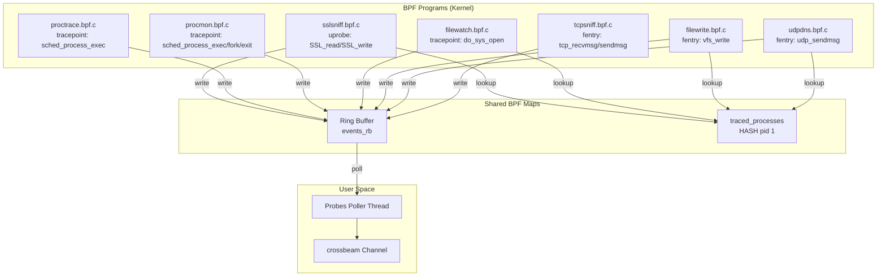

# eBPF Probes Design — AgentSight

## Overview

AgentSight 使用 7 个 eBPF 探针从内核态捕获数据，所有探针共享同一个 ring buffer 和 `traced_processes` BPF map，由 `Probes` 管理器统一协调。

## Probe Architecture

## Probe Details

### 1. sslsniff — SSL/TLS Traffic Capture

- **BPF Type**: uprobe
- **Attach Point**: `SSL_read` / `SSL_write` (OpenSSL/BoringSSL)
- **Filter**: Only capture PIDs in `traced_processes` map
- **Output**: `probe_SSL_data_t` struct (pid, timestamp, fd, data, len, comm)
- **Source**: `src/bpf/sslsniff.bpf.c`, `src/bpf/sslsniff.h`
- **Userspace**: `src/probes/sslsniff.rs`

**How it works**:
1. Userspace calls `SslSniff::attach_process(pid)` to attach SSL uprobe to target process's libssl.so
2. When target process calls SSL_read/SSL_write, BPF program captures decrypted plaintext
3. Data is passed to userspace via ring buffer, parsed as `SslEvent`

**Key design**: Dynamic attach — probes are not attached at startup, but on-demand after Agent process discovery.

### 2. proctrace — Process Command Line Tracing

- **BPF Type**: tracepoint
- **Attach Point**: `sched_process_exec`
- **Filter**: None (captures all execve events)
- **Output**: `VariableEvent` (variable-length: pid, ppid, comm, args)
- **Source**: `src/bpf/proctrace.bpf.c`, `src/bpf/proctrace.h`
- **Userspace**: `src/probes/proctrace.rs`

**Key design**: Variable-length events — execve command line args have variable length, using `common_event_hdr` + `proc_event_header` + variable-length args format.

### 3. procmon — Process Lifecycle Monitor

- **BPF Type**: tracepoint
- **Attach Point**: `sched_process_exec`, `sched_process_fork`, `sched_process_exit`
- **Filter**: None
- **Output**: `procmon_event_t` (Exec/Fork/Exit events)
- **Source**: `src/bpf/procmon.bpf.c`, `src/bpf/procmon.h`
- **Userspace**: `src/probes/procmon.rs`

**Purpose**: Drives Agent auto-discovery. When a new process is created, checks if it's a known Agent and auto-attaches SSL probes.

### 4. filewatch — File Open Monitor

- **BPF Type**: tracepoint
- **Attach Point**: `do_sys_open` / `do_sys_openat2`
- **Filter**: Only monitor PIDs in `traced_processes` map opening `.jsonl` files
- **Output**: `filewatch_event_t` (pid, filename)
- **Source**: `src/bpf/filewatch.bpf.c`, `src/bpf/filewatch.h`
- **Userspace**: `src/probes/filewatch.rs`

**Purpose**: Monitor Agent processes opening .jsonl files for auxiliary Agent session identification.

### 5. filewrite — File Write Capture

- **BPF Type**: fentry
- **Attach Point**: `vfs_write`
- **Filter**: Only PIDs in `traced_processes` writing to `.jsonl` files
- **Output**: `filewrite_event_t` (pid, filename, written content)
- **Source**: `src/bpf/filewrite.bpf.c`, `src/bpf/filewrite.h`
- **Userspace**: `src/probes/filewrite.rs`

**Purpose**: Capture written .jsonl content to recover responseId → sessionId mappings.

### 6. udpdns — DNS Query Capture

- **BPF Type**: fentry
- **Attach Point**: `udp_sendmsg`
- **Filter**: PIDs in `traced_processes`, UDP destination port 53
- **Output**: `udpdns_event_t` (queried domain)
- **Source**: `src/bpf/udpdns.bpf.c`, `src/bpf/udpdns.h`
- **Userspace**: `src/probes/udpdns.rs`

**Purpose**: Resolve configured HTTPS/HTTP domain patterns to IPs at runtime for SSL/TCP attach filtering.

### 7. tcpsniff — Plaintext HTTP Capture

- **BPF Type**: fentry/fexit
- **Attach Point**: `tcp_recvmsg` / `tcp_sendmsg`
- **Filter**: Configured destination IP/port targets (`tcp_targets`)
- **Output**: reuses the sslsniff `probe_SSL_data_t` event format
- **Source**: `src/bpf/tcpsniff.bpf.c`
- **Userspace**: `src/probes/tcpsniff.rs`

**Purpose**: Capture plaintext (non-TLS) HTTP traffic to configured endpoints, e.g. internal MaaS gateways.

## Shared Resource Design

### Ring Buffer (events_rb)

All probes share one ring buffer, distinguished by `common_event_hdr.source` field:

| source value | Event type | Parse method |
|-------------|-----------|-------------|
| 1 (EVENT_SOURCE_PROC) | proctrace event | `VariableEvent::from_bytes()` |
| 2 (EVENT_SOURCE_SSL) | sslsniff event | `SslEvent::from_bytes()` |
| 3 (EVENT_SOURCE_PROCMON) | procmon event | `procmon::Event::from_bytes()` |
| 4 (EVENT_SOURCE_FILEWATCH) | filewatch event | `FileWatchEvent::from_bytes()` |
| 5 (EVENT_SOURCE_FILEWRITE) | filewrite event | `FileWriteEvent::from_bytes()` |
| 6 (EVENT_SOURCE_UDPDNS) | udpdns event | `UdpDnsEvent::from_bytes()` |

**Implementation**: `src/probes/probes.rs:Probes::run()` lines 137-193 — single thread polls ring buffer, dispatches by source field into `Event` enum.

### traced_processes Map

BPF hash map, key=PID, value=1. Used by:
- sslsniff: Only capture SSL traffic from traced processes
- filewatch: Only monitor file opens from traced processes

**Dynamic update**: `Probes::add_traced_pid()` / `Probes::remove_traced_pid()` at runtime.

### PID 命名空间约定

事件里的 pid、以及注册进 `traced_processes` 的 key，**都以"用户态所在的 pid namespace"为基准**。这不是风格问题：用户态拿到 pid 后都要回头解析自己的 `/proc`（cmdline、exe、maps、cgroup，以及 uprobe attach 用的 `/proc/<pid>/root/...`），而 `/proc` 是按**读取者**所在 namespace 编号的。BPF 上报的编号必须落在同一个 namespace，否则解析到的是另一个进程。

`current_observer_pid()`（`src/bpf/common.h`）负责这件事，靠一个 rodata 开关分流：

| 用户态位置 | rodata `observer_pidns_is_init` | 上报的 pid |
|---|---|---|
| 初始 pid namespace（宿主机进程，或 DaemonSet + `hostPID: true`） | `true` | host tgid |
| 某个 pid namespace 内（sidecar + `shareProcessNamespace`） | `false` | 目标最内层 namespace 的 pid |

开关由 `probes::pidns::observer_in_init_pidns()` 在 `open()` 与 `load()` 之间写入每个 skeleton 的 rodata，判定方式是比较 `/proc/self/ns/pid` 的 inode 与内核固定值 `PROC_PID_INIT_INO`。

上表两种情形下，"目标最内层 pid"与"用户态视角 pid"恰好相等，所以历史实现（无条件取最内层）在宿主机和 sidecar 下都是对的；它只在**用户态处于初始 namespace 而目标在容器内**时出错 —— 那时最内层 pid 是个容器内编号，在宿主机上要么不存在，要么属于另一个无关进程。

注意 `bpf_get_ns_current_pid_tgid()` 解决不了这个问题：除非 (dev, ino) 指的就是**当前任务自己**的 namespace，它一律返回 `-EINVAL`，并不会翻译到祖先 namespace。

已知限制：用户态本身在某个 namespace 内、而目标在更深的嵌套 namespace 时，上报的仍是目标最内层 pid，用户态无法解析。此时 `AgentScanner::on_dns_event()` 的空 cmdline 检查会拒绝 attach（fail-closed），不会误挂到别的进程上。

## Build-Time Code Generation

`build.rs` uses `libbpf-cargo` at compile time to:
1. Compile `src/bpf/*.bpf.c` to BPF bytecode
2. Generate Rust skeleton files (auto-load, map access, etc.)
3. Generate vmlinux type bindings via `bindgen`

**Dependencies**: `build-dependencies` in Cargo.toml: `libbpf-cargo`, `bindgen`, `cc`.

## Performance Considerations

1. **Single poll thread**: One background thread polls ring buffer, dispatches via crossbeam channel
2. **LRU cache**: HTTP connection aggregation uses LRU cache (default 24 entries) to prevent unbounded memory growth
3. **PID filtering**: BPF-side filtering, only uploads data from traced processes, reducing kernel-userspace data copy
4. **Non-blocking**: `Probes::try_recv()` is non-blocking, main loop sleeps 10ms when idle
