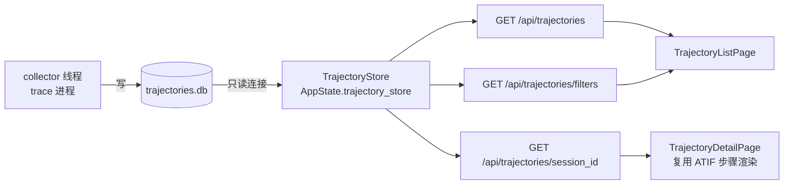

# 采集轨迹查询 API 与 Dashboard 接入设计

> 状态：**草案（待评审）**
> 关联：PR #1789（`feat(sight): add Qoder trajectory collector crates`）的下游消费侧
> 范围：让 Dashboard 能浏览/检索 `trajectories.db` 中已采集的 Qoder/QoderWork ATIF v1.7 轨迹

## 1. 背景与目标

PR #1789 完成了轨迹的**采集 + 持久化**：后台线程把 Qoder/QoderWork 的 JSONL 会话转换为
ATIF v1.7 文档，upsert 进 `trajectories.db` 的 `collected_trajectories` 表。但**消费侧缺失**：

- `src/server/` 没有任何 handler 打开 `trajectories.db`；
- Dashboard 没有浏览入口（现有 "ATIF 查看器" 走的是 eBPF 采集的 v1.6 导出链路，数据源不同）。

**目标**：新增只读查询 API + Dashboard 页面，使用户能按 project / source / agent 检索采集到的轨迹，
并查看单条轨迹的完整 ATIF 步骤时间线。

**非目标**（本期不做）：

- 不改动采集器写入逻辑与表结构；
- 不统一 v1.6（eBPF 导出）与 v1.7（文件采集）两条 ATIF 链路（后续独立 ADR）；
- 不做轨迹的编辑/删除/标注（仅只读浏览）。

## 2. 现状数据流


**关键约束**：collector 与 API server 是**两个独立进程**（`trace` vs `serve`），
通过 SQLite **WAL 模式**共享同一 DB 文件（collector 已设 `journal_mode=WAL`，支持单写多读）。

## 3. 目标架构



## 4. 后端设计

### 4.1 Store 层（`crates/agentsight-trajectory-collector/src/store.rs`）

在现有 `TrajectoryStore` 上**新增只读查询方法**（Footprint Ladder 级别 1：扩展现有类型）：

| 方法 | 说明 |
|------|------|
| `list_summaries(project, source, agent_name, limit) -> Result<Vec<TrajectorySummary>>` | 列表，**不返回 `atif_json`**（该字段可能很大），按 `collected_at_ns DESC` 排序 |
| `get_atif_json(session_id) -> Result<Option<String>>` | 仅取 `atif_json` 一列，供详情渲染 |
| `list_filters() -> Result<TrajectoryFilters>` | `SELECT DISTINCT project/source/agent_name`，供前端下拉框 |

新增轻量 DTO（`Serialize`）：

```rust
pub struct TrajectorySummary {
    pub session_id: String,
    pub schema_version: String,
    pub agent_name: String,
    pub model_name: Option<String>,
    pub num_steps: i64,
    pub total_prompt_tokens: Option<i64>,
    pub total_completion_tokens: Option<i64>,
    pub start_time: Option<String>,
    pub end_time: Option<String>,
    pub project: String,
    pub source: String,        // "qoder" | "qoderwork"
    pub is_subagent: bool,
    pub collected_at_ns: i64,
}

pub struct TrajectoryFilters {
    pub projects: Vec<String>,
    pub sources: Vec<String>,
    pub agent_names: Vec<String>,
}
```

> 所有 SQL 继续使用 `params![]` 参数化（沿用现有防注入规范）；过滤条件用动态 `WHERE` 拼接 + 绑定参数。

### 4.2 AppState 与初始化（`src/server/mod.rs`）

仿照 `interruption_store` 的长连接模式，新增可选字段：

```rust
pub struct AppState {
    // ... 既有字段
    pub trajectory_store: Option<Arc<TrajectoryStore>>,
}
```

`run_server` 中初始化（路径经 §4.2.1 的共享 helper 派生，**与 collector 同源**）：

```rust
let trajectory_store = {
    let db_path = crate::storage::sqlite::sibling_db_path("trajectories.db");
    match TrajectoryStore::new_with_path(&db_path) {
        Ok(s) => Some(Arc::new(s)),
        Err(e) => { log::warn!("Trajectory store unavailable: {e}"); None }
    }
};
```

**决策**：serve 仅在 `trajectories.db` 文件**已存在**时尝试只读打开，不会创建空 DB。
理由：采集由 `trace` 进程负责，`serve` 只消费；用户可能先采集、后开 Dashboard 查看历史数据。
DB 不存在时 `trajectory_store=None` → 列表/过滤端点返回空 + 200，detail 端点返回 404（见 §5.3 / §6 D4）。
这避免了 serve 模式在采集从未启用时产生空 DB 文件的持久化副作用。

> **注意**：collector crate 的 `TrajectoryStore::new_with_path` 使用裸 `Connection::open`，
> **不会创建父目录**（不同于主 crate `connection::create_connection` 的 `create_dir_all`）。
> 故依赖 base 目录 `/var/log/sysak/.agentsight` 已存在（server 启动时 genai/interruption 等 store 会先创建它）；
> 若 base 目录缺失，`new_with_path` 报错 → `trajectory_store=None` → 按 D4 返回空 + 200。

#### 4.2.1 共享路径 helper（消除 D3 漂移）

**问题**：`trajectories.db` 的位置是间接推导的——取 `GenAISqliteStore::default_path()`
（`<base>/genai_events.db`）的父目录再拼文件名。collector（`trace` 进程）与 server（`serve` 进程）
分属两个进程，若各自手抄这段表达式，一旦 base 路径逻辑变更（如未来支持可配置 base），
两端推导不一致就会**读到空库**；且 `new_with_path` 在文件缺失时会静默创建空表，
Dashboard 永远显示"暂无数据"而**无任何错误日志指向路径错误**，极难排查。
现状 `unified.rs`（collector）与 `mod.rs`（interruption store）已各有一份该表达式副本。

**方案**：在 `src/storage/sqlite/connection.rs` 提取单一来源 helper，读写两端统一调用。
**关键**：helper 直接基于 `default_base_path()` 派生，而**不**经 `GenAISqliteStore::default_path().parent()`——
因为 `genai` 模块依赖 `connection`（用其建连接），若底层 `connection.rs` 反向引用上层 `genai` 会形成模块内循环依赖；
且 `genai_events.db` 本就定义为 `default_base_path().join("genai_events.db")`，两者等价，直接用 base 更干净：

```rust
/// 与 genai_events.db 同目录（即 default_base_path()）的附属数据库路径
/// （trajectories.db / interruption_events.db 等），保证跨进程读写同源。
pub fn sibling_db_path(filename: &str) -> PathBuf {
    default_base_path().join(filename)
}
```

并在 `storage/sqlite/mod.rs` re-export（`pub use connection::{..., sibling_db_path};`）。

落地范围（PR-A 内顺带完成，Footprint Ladder 级别 2）：

- collector（`unified.rs`）：`db_path: sibling_db_path("trajectories.db")`（替换现有 `GenAISqliteStore::default_path().parent()...` 表达式，行为等价）；
- server（`mod.rs`）：`sibling_db_path("trajectories.db")`；
- interruption store（`mod.rs`）：`sibling_db_path("interruption_events.db")`（消除既有重复副本）。

### 4.3 Handler 与路由（`src/server/handlers.rs`）

| 路由 | 方法 | 查询参数 | 返回 |
|------|------|----------|------|
| `/api/trajectories` | GET | `project`, `source`, `agent_name`, `limit`(默认 200) | `Vec<TrajectorySummary>` |
| `/api/trajectories/{session_id}` | GET | — | 原始 ATIF v1.7 JSON（直接回传存储的 `atif_json` 字符串，`Content-Type: application/json`，不二次解析） |
| `/api/trajectories/filters` | GET | — | `TrajectoryFilters` |

错误语义：

- store 为 `None`（DB 不存在或打不开）→ **统一返回空结果 + 200**（`[]` / 空 filters），而非 503；
  采集是默认关闭的可选功能，DB 缺失是正常状态，Dashboard 其他列表页也都能容忍空数据，故不单独报错（见 §6 D4）；
- `session_id` 不存在 → `404 {"error":"not_found"}`；
- SQL 失败 → `500 {"error": ...}`。

> 注意路由注册顺序：`/api/trajectories/filters` 必须在 `/api/trajectories/{session_id}` **之前**
> 注册，否则 `filters` 会被当成 `session_id` 捕获（actix 动态段匹配）。

### 4.4 文档同步

- `AGENTS.md` §8 API Endpoints 表新增 3 行；
- `AGENTS.md` §4 Module Map 的 TrajectoryCollector 行补充"可经 `/api/trajectories` 查询"。

## 5. 前端设计

### 5.1 apiClient（`dashboard/src/utils/apiClient.ts`）

```ts
export interface TrajectorySummary { /* 镜像后端 DTO */ }
export interface TrajectoryFilters { projects: string[]; sources: string[]; agent_names: string[]; }

export async function fetchTrajectories(params?: {project?: string; source?: string; agent_name?: string; limit?: number}): Promise<TrajectorySummary[]>;
export async function fetchTrajectoryDetail(sessionId: string): Promise<AtifDocument>; // atif_json 直接解析为 AtifDocument
export async function fetchTrajectoryFilters(): Promise<TrajectoryFilters>;
```

> `atif_json` 是 ATIF v1.7，与现有 `AtifDocument` 类型结构兼容（v1.7 多出的
> `reasoning_effort`/`llm_call_count`/`is_copied_context` 字段前端类型可忽略）。

### 5.2 页面与路由

| 文件 | 职责 |
|------|------|
| `pages/TrajectoryListPage.tsx`（新增） | 过滤栏（project/source/agent 下拉）+ 表格（agent、project、source、steps、tokens、采集时间、subagent 标记）；行点击进详情 |
| `pages/TrajectoryDetailPage.tsx`（新增） | `useParams` 取 `sessionId` → `fetchTrajectoryDetail` → 渲染 ATIF 步骤时间线 |
| `App.tsx` | 新增 `/trajectories` 与 `/trajectories/:sessionId` 路由 |
| `components/NavBar.tsx` | `navItems` 新增 `{ path: '/trajectories', label: '轨迹采集', icon: '🧭' }` |

**步骤渲染复用策略**：`AtifViewerPage.tsx`（747 行）当前与 v1.6 导出 API + savings/optimization 耦合。
本期**不做大重构**：将其中纯展示的步骤时间线子树**抽取**为 `components/AtifStepTimeline.tsx`，
由 `AtifViewerPage` 与 `TrajectoryDetailPage` 共同复用（Footprint Ladder 级别 2）。
若抽取导致单 PR 超 800 行，则降级为 `TrajectoryDetailPage` 内独立实现一份精简渲染，重构留待后续。

### 5.3 空态与错误态

- 列表为空：展示引导文案"尚未采集到轨迹。请在 `agentsight.json` 开启
  `features.trajectory_collection.enabled` 并运行 `agentsight trace`"；
- 详情 404：提示"轨迹不存在或已被重新采集覆盖"。

## 6. 关键设计决策

| # | 决策点 | 选择 | 理由 / 替代方案 |
|---|--------|------|-----------------|
| D1 | store 生命周期 | AppState 长连接（`Option<Arc<TrajectoryStore>>`） | 对齐 `interruption_store`；替代：每请求开连接（对齐 `list_sessions`）——被否，避免频繁 open |
| D2 | 跨进程共享 | 独立只读连接 + 既有 WAL | collector(trace) 与 server(serve) 不同进程，WAL 支持单写多读，无需 IPC |
| D3 | DB 路径派生 | 抽 `sibling_db_path()` 共享 helper，读写两端同源（见 §4.2.1） | 避免跨进程手抄表达式漂移导致静默读空库 |
| D4 | store 缺失语义 | 统一返回空 + 200（非 503） | 采集默认关闭，DB 缺失是正常状态；Dashboard 其他列表页均能容忍空数据，不单独报错，前端无需错误分支 |
| D5 | 列表是否含 atif_json | 不含，详情接口单独取 | 列表轻量化，避免大 JSON 拖慢首屏 |
| D6 | v1.6/v1.7 链路 | 本期并存，不统一 | 统一涉及导出链路迁移，范围大，独立 ADR 处理 |
| D7 | 步骤渲染 | 抽取共享组件（级别 2） | 复用而非复制；超 800 行则降级为独立精简实现 |

## 7. Footprint Ladder 说明

| 变更 | 级别 | 说明 |
|------|------|------|
| `TrajectoryStore` 新增查询方法 + DTO | **1** | 扩展现有类型 |
| 提取 `sibling_db_path` 路径 helper | **2** | 模块内复用，消除既有重复副本 |
| 抽取 `AtifStepTimeline` 共享组件 | **2** | 模块内复用 |
| 新增 2 个前端页面 | **3** | 职责独立，现有页面无法容纳 |
| 新增 3 个 handler | **1** | 扩展现有 `handlers.rs` |

无 eBPF（级别 4）/ FFI（级别 5）变更。

## 8. 测试计划

**后端**（必须，属存储/服务层逻辑变更）：

- `store.rs` 单测：`list_summaries` 过滤组合、排序、`limit`；`get_atif_json` 命中/未命中；`list_filters` 去重；
- `handlers.rs` 集成测试（`actix_web::test`）：
  - 列表 200 + 过滤生效；
  - 详情 200（返回合法 ATIF JSON）/ 404（不存在）；
  - `filters` 路由不被 `{session_id}` 误捕获（注册顺序回归）；
  - store 为 `None` 时返回空 + 200。

**前端**：

- `apiClient` 三个方法的类型与 URL 拼装；
- 列表页过滤交互、详情页 404 兜底（vitest）。

**手工验证**：

1. 开启 `features.trajectory_collection.enabled`，`agentsight trace` 采集真实 Qoder 会话；
2. `agentsight serve` 打开 Dashboard "轨迹采集" 页，确认列表/过滤/详情步骤时间线正确；
3. 关闭采集功能重启 serve，确认页面展示空态而非报错。

## 9. 拆分与落地计划

为遵守 PR diff ≤ 800 行约束，建议拆为两个 PR：

| 阶段 | 内容 | 预估规模 |
|------|------|----------|
| **PR-A（后端）** | `sibling_db_path` helper + store 查询方法 + DTO + 3 handler + 路由 + AppState 接线 + AGENTS.md + 后端测试 | ~430 行 |
| **PR-B（前端）** | apiClient + 2 页面 + 路由/导航 + `AtifStepTimeline` 抽取 + 前端测试 | ~500 行 |

PR-B 依赖 PR-A 合入。

> **合入顺序**：PR-A 会修改 `unified.rs` 中 collector 的 `db_path` 派生表达式（§4.2.1），
> 该段代码由 PR #1789 引入，故 **PR-A 须在 #1789 合入后**再基于最新 main 提交。

## 10. 风险与注意

- **schema 演进**：`collected_trajectories` 表无 `schema_version` 迁移机制；本期只读，新增列需配套 `CREATE TABLE` 兼容（`IF NOT EXISTS` 不升级旧表结构）——若后续加列须处理旧库；
- **大轨迹**：单条 `atif_json` 可能很大（长会话），详情接口直接返回整串，前端按需渲染/折叠；
- **路径一致性（D3）**：最大踩坑点——跨进程手抄路径表达式一旦漂移会静默读空库（`new_with_path` 缺失时静默建空表、无错误日志）。**已在 §4.2.1 纳入设计**：PR-A 提取 `sibling_db_path()` 单一来源 helper，collector/server/interruption store 统一调用，物理杜绝漂移。
